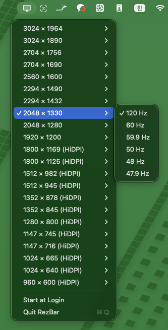

# RezBar

A small macOS menu bar app for switching display resolutions.

macOS hides most of the modes your display actually supports. RezBar lists all of them —
including HiDPI (Retina-scaled) modes and every refresh rate — and lets you switch with one click,
without opening System Settings.



## Features

- Every display mode CoreGraphics reports, not just the handful System Settings shows
- HiDPI modes clearly marked
- Refresh rates grouped under each resolution, so the list stays short
- A checkmark on the mode you are currently using
- Multiple displays each get their own submenu
- The menu is rebuilt every time you open it, so hot-plugged displays and changes made elsewhere
  show up immediately
- Optional "Start at Login"
- No Dock icon, no window, no background daemon

## Requirements

- macOS 14.0 or later
- Apple silicon or Intel

## Building

RezBar is distributed as source only. There is no signed or notarized release build.

```sh
brew install xcodegen        # once
xcodegen generate
xcodebuild -project RezBar.xcodeproj -scheme RezBar -configuration Release build
```

The built app is written to Xcode's DerivedData folder; the build output ends with its path.
Copy `RezBar.app` to `/Applications` when you are done.

If `xcodebuild` picks the Command Line Tools instead of Xcode, prefix the command:

```sh
env DEVELOPER_DIR=/Applications/Xcode.app xcodebuild ...
```

### Gatekeeper

The app is signed ad-hoc (a local, self-issued signature), so macOS will not recognise a
developer. The first launch needs an extra step: right-click `RezBar.app` → **Open** →
**Open** again in the dialog. After that it launches normally.

### Start at Login

Register the login item only after moving RezBar to `/Applications`. macOS binds the login item
to the exact path of the app it was registered from, so a login item registered from a build
folder breaks as soon as that folder is cleaned. macOS may also ask you to approve the item in
System Settings → General → Login Items.

## Verifying the display APIs

A standalone script exercises the CoreGraphics calls RezBar relies on, without building the app:

```sh
swift Scripts/probe.swift            # list displays and modes (read-only)
swift Scripts/probe.swift --switch   # switch, verify, restore, verify
```

`--switch` changes the main display's resolution and immediately puts it back. Expect one
short flicker.

## A note of caution

RezBar lists the modes your display reports, and some displays report modes they cannot
actually show. Selecting one on an external display can leave the screen black. **RezBar does
not automatically revert after a timeout.** If it happens, unplug and replug the display, or
switch back from another display.

Modes on the built-in display of a Mac laptop are safe.

## How it works

- `Sources/DisplayManager.swift` — the only file that talks to CoreGraphics. `CGGetActiveDisplayList`
  is the source of truth for which displays exist, because `NSScreen` omits secondary displays
  while mirroring is active. Modes are read with `kCGDisplayShowDuplicateLowResolutionModes` so
  scaled modes are not hidden.
- `Sources/ModeInfo.swift` — value types. `CGDisplayMode` is converted at the boundary, which is
  what makes the rest of the app testable.
- `Sources/ModeLogic.swift` — deduplication, sorting, grouping and labelling, as pure functions.
- `Sources/MenuController.swift` — builds the menu from scratch on every open.

Run the tests with:

```sh
xcodebuild -project RezBar.xcodeproj -scheme RezBar -destination 'platform=macOS' test
```

## Status

Version 1.0. RezBar is an independent implementation, written from the public CoreGraphics
display APIs.

## License

MIT — see [LICENSE](LICENSE).
